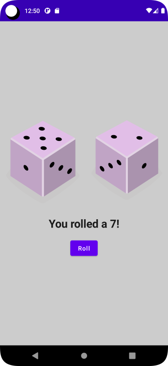

# Dice Roller App 

## An app that lets the user roll 2 dices with the click of a button
* We display a 
  * Two dice images and a button

## We Learn
* Column
* Row
* Image Composable
* Text Composables
* Button Composable
* by remember to preserve a state

## Codelab Screenshot

ref: dice-roller-app-android-kotlin-compose